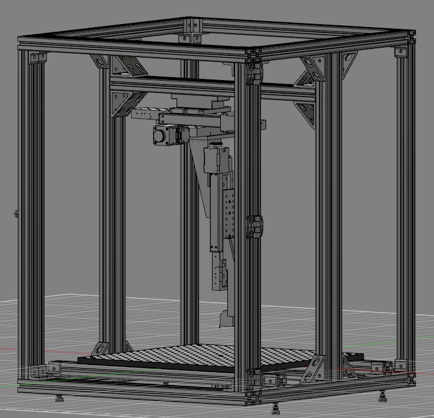
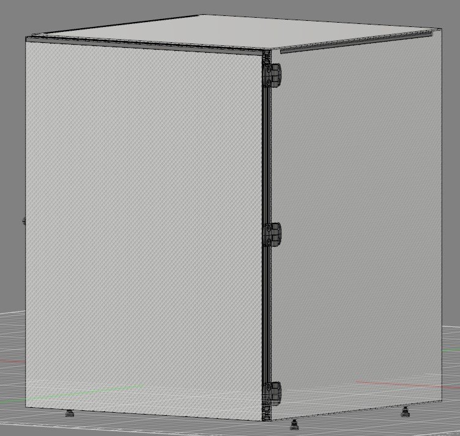
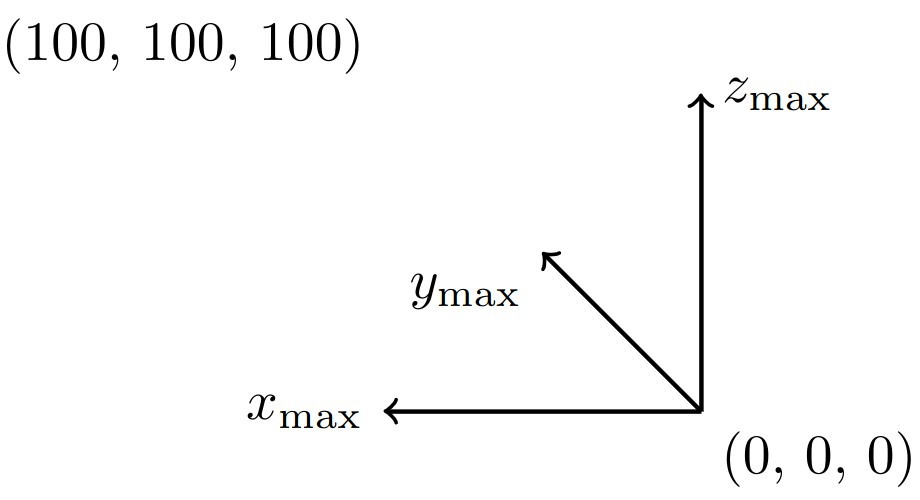

# Open-XYZ
An Open-Source Positioning System for Physical Attacks Exhibiting Spatial Resolution

**Author:** Marvin Sass
**Contributors:** Jakob Frömbgen, Olaf Durban

## Installation

### 1. Clone Repository with Submodules

```bash
git clone --recursive git@github.com:HWS-XMS/OpenXYZ.git
cd OpenXYZ
```

If you already cloned without `--recursive`:
```bash
git submodule update --init --recursive
```

### 2. Install Python Dependencies

**Host Computer:**
```bash
# Create and activate virtual environment (recommended)
python3 -m venv venv
source venv/bin/activate  # macOS/Linux
# .\venv\Scripts\activate  # Windows

# Install dependencies
pip3 install -r requirements.txt

# Install CoordinatePaths package from submodule
pip3 install -e CoordinatePaths/
```

**Raspberry Pi (for running the bridge server):**
```bash
pip3 install -r requirements-rpi.txt
```

## Path Generation

Path generation is handled by the separate [CoordinatePaths](https://github.com/HWS-XMS/CoordinatePaths) package (included as a git submodule). Three path types are available:

**RectangularPath** - Snake-like raster scanning:
```
(x_max, y_max)
  END +-->+-->+-->#
      ^   |   |   |
      +<--+<--+<--+
      |   |   |   ^
      +-->+-->+-->+
      ^   |   |   |
      +<--+<--+<--# START
                (0,0)
```

**CircularPath** - Spiral scanning from center outward

**PolygonPath** - Raster scanning within arbitrary polygonal areas

## Stage Positioning


The coordinate system origin is located at the bottom right (0, 0, 0). All coordinates are in millimeters. The stage supports 3-axis movement:
- **X/Y axes**: Horizontal positioning of probe
- **Z axis**: Height adjustment above target

## Usage

Complete working examples are available in the `examples/` directory:
- `basic_scan_with_callback.py` - Rectangular scanning with measurement callback
- `circular_scan_example.py` - Circular/spiral scanning pattern
- `read_scan_results.py` - Loading and processing saved measurement data

### Basic Example

```python
from openxyz.xyz_stage import Stage
from openxyz.marlin import Marlin
from coordinate_paths import RectangularPath
import decimal
import pickle

# Initialize stage
stage = Stage(Marlin(ip="openxyz"))  # or use IP address like "192.168.1.100"

# Create scanning path
path = RectangularPath(
    start_xy=(decimal.Decimal('0'), decimal.Decimal('0')),
    end_xy=(decimal.Decimal('10'), decimal.Decimal('10')),
    step_size_x=decimal.Decimal('0.5'),
    step_size_y=decimal.Decimal('0.5')
)

# Set probe height
stage.z = decimal.Decimal('40')

# Scan and measure
with open('results.pckl', 'wb') as f:
    for coordinate in path:
        # Move to position
        stage.x = coordinate[0]
        stage.y = coordinate[1]

        # Your measurement code here
        data = your_measurement_function()

        # Save with position
        pickle.dump((coordinate, data), f)
```

## Hardware Components

- **Motion Control**: Marlin firmware on BTT Manta M8P board
- **Actuators**: Motorized linear stages with TMC stepper drivers
- **Position Feedback**: LS7366R encoder chips with optical encoders
- **Control Interface**: Raspberry Pi running Flask server (optional bridge)

See `documentation/hardware/` for detailed hardware documentation.

## Architecture

**Host Computer** (your workstation):
- Runs measurement scripts
- Generates scan paths using CoordinatePaths
- Sends G-code commands to stage via HTTP

**Raspberry Pi** (optional bridge, runs `openxyz/rpi.py`):
- Flask HTTP server
- Converts HTTP requests to serial G-code
- Reads encoder positions via SPI
- Direct connection to Marlin controller

**Marlin Controller** (BTT Manta M8P):
- Executes G-code movement commands
- Controls stepper motors via TMC drivers
- Handles position tracking and limits

## License

MIT License

## Repository

https://github.com/HWS-XMS/OpenXYZ